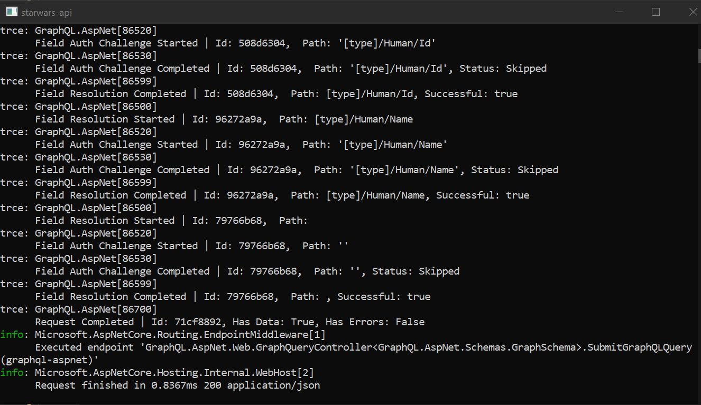

GraphQL ASP.NET utilizes structured logging for reporting runtime events. The log messages generated aren't just strings but actual objects. All internal log events are raised as objects that implement from `IGraphLogEntry`.

## IServiceCollection.AddLogging()

GraphQL's logging extends off of .NET's built in logging framework. To enable it, you need to register logging to your application at startup. By doing so, GraphQL will automatically wire up its own logging as well.

```csharp title="Register Standard Logging"
// Adding Logging before calling AddGraphQL
services.AddLogging();

service.AddGraphQL(/*...*/);
```

## Using IGraphLogger

Its common practice to inject an instance of `ILogger` or `ILoggerFactory` into a controller in order to log various events of your controller methods.

This is fully supported but the library can also generate an instance of `IGraphLogger` with a few helpful methods for raising "on the fly" log entries if you wish to make use of it. `IGraphLogger` implements `ILogger`, the two can be used interchangeably as needed.

```csharp title="Using IGraphLogger"
public class BakeryController : GraphController
{
    private IGraphLogger _graphLogger;
    private IDonutService _service;
    // highlight-next-line
    public BakeryController(IDonutService service, IGraphLogger graphLogger)
    {
        _service = service;
        _graphLogger = graphLogger;
    }

    [MutationRoot]
    public Donut CreateDonut(string name)
    {
        Donut donut = _service.CreateDonut(name);

        // highlight-start
        var donutEvent = new GraphLogEntry("New Donut Created!");
        donutEvent["Name"] = name;
        donutEvent["Id"] = donut.Id;

        _graphLogger.Log(LogLevel.Information, donutEvent);
        // highlight-end

        return donut;
    }
}
```

:::tip
 `GraphLogEntry` is an untyped implementation of `IGraphLogEntry` and can be used on the fly for quick operations or as a basis for custom log entries.
:::

## Custom ILoggers

By default, the log events will return a contextual message on `.ToString()` with the important data related to the event. This is very handy when logging to the console during development.



But given the extra data the log entries contain, it makes more sense to create a custom `ILogger` to take advantage of the full object.

```csharp title="Custom ILogger"
public class MyCustomLogger : ILogger
{
    // other code ommited for brevity

    public void Log<TState>(LogLevel logLevel, EventId eventId,
        TState state, Exception exception, Func<TState, Exception, string> formatter)
    {
        // highlight-next-line
        if (state is IGraphLogEntry logEntry)
        {
            // handle the log entry here
        }
    }
}
```

:::info
 The state parameter of `ILogger.Log()` will be an instance of `IGraphLogEntry` whenever a GraphQL ASP.NET log event is recorded.
:::

## Log Entries are KeyValuePair Collections

While the various [standard log events](./standard-events) declare explicit properties for the data they return, every log entry is just a collection of key/value pairs that can be iterated through for quick serialization.

```csharp
public interface IGraphLogEntry : IEnumerable<KeyValuePair<string, object>>
{ /*...*/ }
```

## Logging Category

All log events are registered under the the `GraphQL.AspNet` category. With the exception of field authorization fails, all log events are recorded at `Debug` or `Trace`.

Here we've enabled the log events through `appsettings.json`

```json title="appsettings.json"
{
    "Logging" : {
        "IncludeScopes" : false,
        "LogLevel": {
            "Default" : "Information",
            "System": "Debug",
            "Microsoft": "Information",
            // highlight-next-line
            "GraphQL.AspNet" : "Debug"
        }
    }
}
```

Log Entries are not allocated unless their respective log levels are enabled. It is not uncommon for real world queries to generate 100s of log entries per request. Take care to ensure you have setup your logging appropriately in a given environment as it can greatly impact performance if left on by accident. 

:::caution 
It is never a good idea to enable trace level logging outside of development.
:::

### Scoped Log Entries

`IGraphLogger` is generated from your service provider on a "per scope" basis. By default, this is at the HTTP Request level. Any log entries created through it using `.Log(LogLevel, IGraphLogEntry)` will be injected with a `scopeId` and along with the date can produce a complete record of a request from when it was received through query plan generation, authorization and field resolution.

Here we've used a custom `ILogProvider` and written out a small sample of events to a json array. Note the shared `scopeId` on each entry. See the [example projects](./../reference/demo-projects.md) to download the code.

```json
[{
  "eventId": 86000,
  "eventName": "GraphQL Request Received",
  "dateTimeUTC": "2022-09-23T22:05:39.6023597+00:00",
  "logEntryId": "6afdf3d1f9464679becfbd2b96aa594f",
  "operationRequestId": "a13f5f7232dc475783c4e4798cfb50d2",
  "userName": "john-doe",
  "queryOperationName": null,
  "queryText": "query {\n  hero(episode: EMPIRE){\n    id\n    name    \n  }\n}",
  "scopeId": "3c3c858b1b344d0b9c0f8ac6b95469d1"
},
{
  "eventId": 86400,
  "eventName": "GraphQL Query Plan Generated",
  "dateTimeUTC": "2022-09-23T22:05:39.7214431+00:00",
  "logEntryId": "d133e032e2fc42a98a639ee8c72d2497",
  "schemaType": "GraphQL.AspNet.Schemas.GraphSchema",
  "isValid": true,
  "operationCount": 1,
  "estimatedComplexity": 9.5076,
  "maxDepth": 2,
  "queryPlanId": "57caffc5d5124f2fb08419ae99724974",
  "scopeId": "3c3c858b1b344d0b9c0f8ac6b95469d1"
},
{
  "eventId": 86599,
  "eventName": "GraphQL Field Resolution Completed",
  "path": "[type]/Human/Id",
  "dateTimeUTC": "2022-09-23T22:05:39.8528847+00:00",
  "logEntryId": "750ee155bf7e4eea895e5eec01d3fb6d",
  "pipelineRequestId": "aa670d3e2d6a41e1b314711acf6bc51c",
  "typeExpression": "ID!",
  "hasData": true,
  "resultIsValid": true,
  "scopeId": "3c3c858b1b344d0b9c0f8ac6b95469d1"
}]
```
